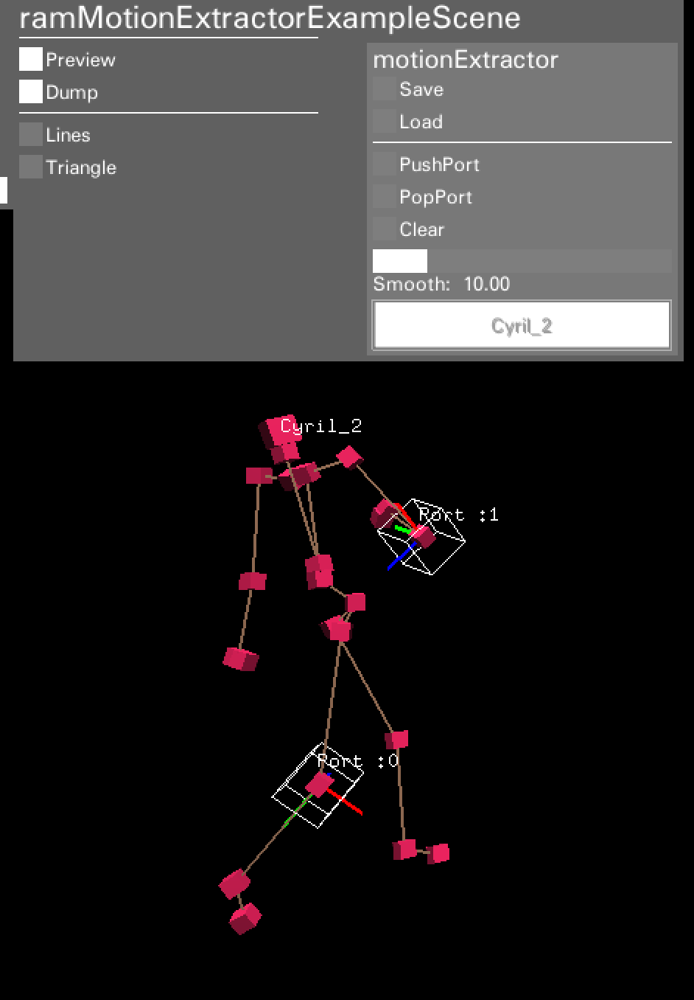

#ramMotionExtractor

ramMotionExtractor allows you to select an actor's nodes.

##Implementation
To implement the ramMotionExtractor, you need an motionExtractor instance in your scene class. From there, you need to call **3 methods**.

The following is an sample from **example-ramMotionExtractor**.
~~~
void ramMotionExtractorExampleScene::setupControlPanel(){
	
	/*=== register ===*/
	motionExtractor.setupControlPanel(this);
	
}

void ramMotionExtractorExampleScene::update(){

	/*=== update ===*/
	motionExtractor.update();

}

void ramMotionExtractorExampleScene::draw(){

	ramBeginCamera();
	
	/*=== Preview selected nodes ===*/
	motionExtractor.draw();
	
	ramEndCamera();
	
}
~~~

##Usage

When you use the ramMotionExtractor, it has its own GUI on the right side of the console panel 

###Pushing a port
When you select a node, a red circle will appear on the node you selected. If you select **PushPort** on the GUI, this will register the node to the motionExtractor. If this is sucessful, a white wire cube will appear. This is called a "port".

###Removing a port
If you want to remove a port that you added, simply select the node by clicking it and select **PopPort** from the GUI. This will remove the selected port.

If you want to clear all ports, select **Clear** from the GUI. This will clear all ports.

###Saving and Loading
You can save and load port selection data by the save and load buttons, respectively.
As a default, the data will be saved with the file name **motionExt_SceneName.xml**, but you can call the  **ramMotionExtractor::Save(string file** & **ramMotionExtractor::Load(string file)** method and save the file with a custom file name.

##Connecting to the scenes
You can use the selected ports in a program by using the following code:
###Example:draw triangle by selected 3 points

	ofVec3f vec_a = motionExtractor.getPositionAt(0);
	ofVec3f vec_b = motionExtractor.getPositionAt(1);
	ofVec3f vec_c = motionExtractor.getPositionAt(2);

	ofSetLineWidth(3.0);
	ofNoFill();
	ofTriangle(vec_a, vec_b, vec_c);
	ofFill();
	ofSetLineWidth(1.0);

[[/Images/API-motionExtractor/pic-triangle.png]]

The **ramMotionExtractor::getPositionAt** method returns global position you selected.
If no port is chosen, it will return point(0,0,0).

Other getter methods for getting informatiom from a port are as follows:

	int				getNumPort();
	bool			getIsExist(int port);

	ramNode			getNodeAt(int port);
	string			getActorNameAt(int port);
	string			getJointNameAt(int port);
	int				getJointIdAt(int port);

	ofVec3f			getPositionAt(int port,bool fixPosition = false);
	ofQuaternion	getRotationAt(int port);

	ofVec3f			getVelocityAt(int port);
	float			getVelocitySpeedAt(int port);
	ofQuaternion	getRotateVelocityAt(int port);
	float			getDistanceAt(int port_A, int port_B);
	float			getAreaAt(int port_A, int port_B, int port_C);

##Editing with OSC
motionExtractor can be edited via OSC messages.

The following are protocol details:

**/ram/MEX/push i, i**：Push port at actor(i-0), node(i-1)

**/ram/MEX/pop i, i**：Pop port at actor(i-0), node(i-1)

**/ram/MEX/clear**：Clear all ports.

**/ram/MEX/save s**：Save motionExtractor data with filename(s)

**/ram/MEX/load s**：Load motionExtractor data from filename(s)
